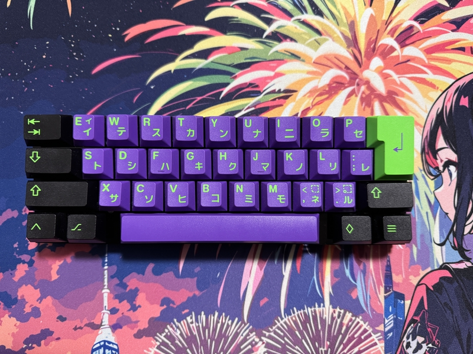
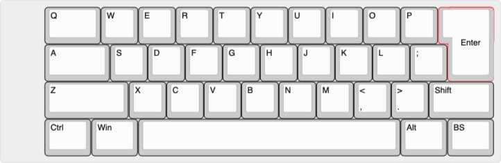

# tacash36

## What is tacash36?

tacash36 is small keyboard.
 
tacash36 has 36keys.
 

This layout has this image.
 

This keyboard use Pro micro or BLE Micro Pro, run qmk_firmware.
 
With this keyboard, you can edit your favorite keymap using vial.
 
