# Build guide

back side of PCB（PCBの裏面）

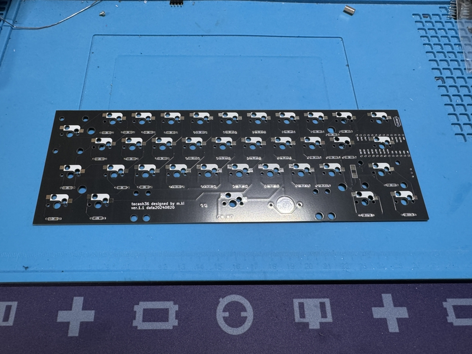

## Build 1

### 1 Diode soldering

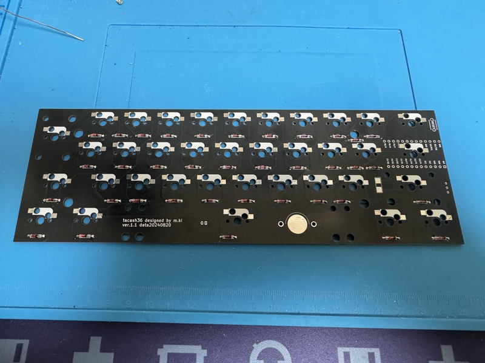

Solder the diodes to the back of PCB.
 
PCBの裏面にダイオードのハンダ付けをします。
 
There are lead type and SMD diodes.
 
ダイオードはリードタイプか、SMDがあります。
 
Here, we will explain the lead type soldering.
 
ここでは、リードタイプのハンダ付けの説明をします。
 

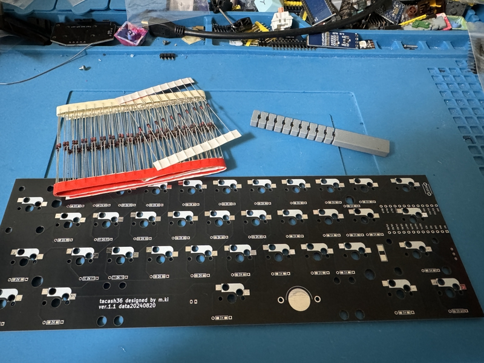

Use a lead bender to bend the legs of the diode.
 
リードベンダーを使い、ダイオードの足を曲げます。
 
Insert the diode into the board.
 
ダイオードを基板に挿しこみます。
 

Please pay attention to the orientation of the diode.
 
ダイオードの向きに注意してください。
 

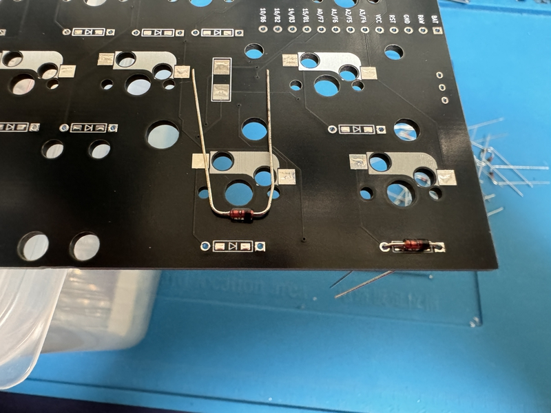

Please solder.
 
はんだ付けをしてください。
 
 
Then, cut off the excess lead with nippers.
 
その後、余ったリードをニッパーで切り取ってください。

[８倍速　Diodeハンダ付け動画](https://youtu.be/Yaodh2-XxV4)

 
 

### 2 Switch socket soldering

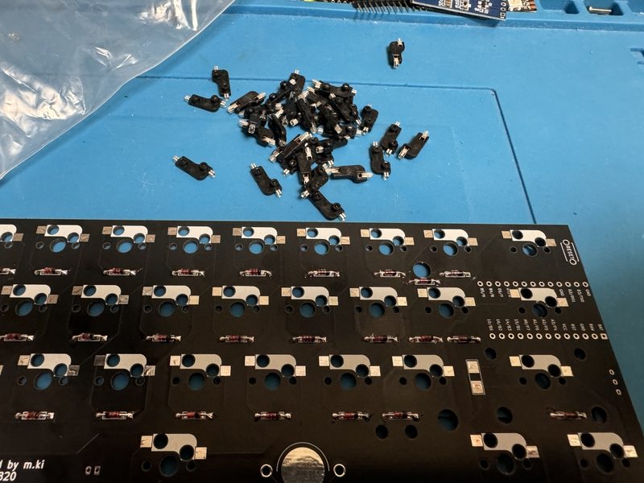

Solder the switch sockets on the back side.
 
裏面にスイッチソケットのハンダ付けをします。
 

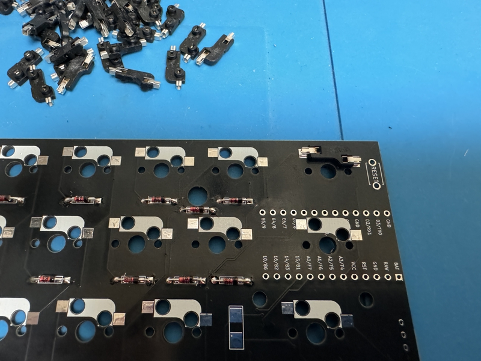

[８倍速　Switch socketハンダ付け動画](https://youtu.be/E__mHvmIXQo)

### 3 Reset switch soldering

Insert the reset switch from the back of the PCB and solder the exposed part.
 
リセットスイッチをPCBの裏面から差し込んで、表面に出た部分をはんだ付けしてください。
 

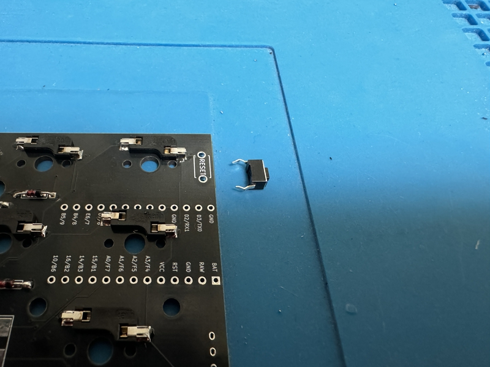

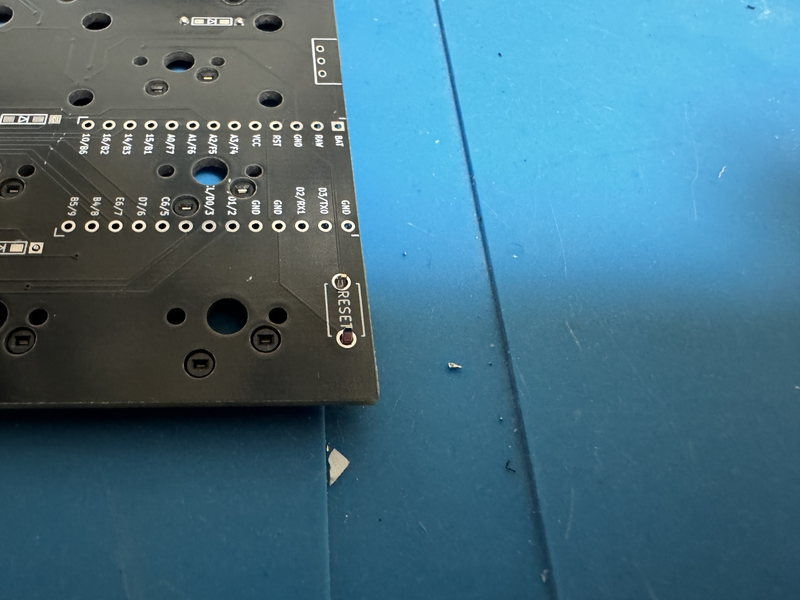

### 4 Battery parts soldering(Bluetooth option)

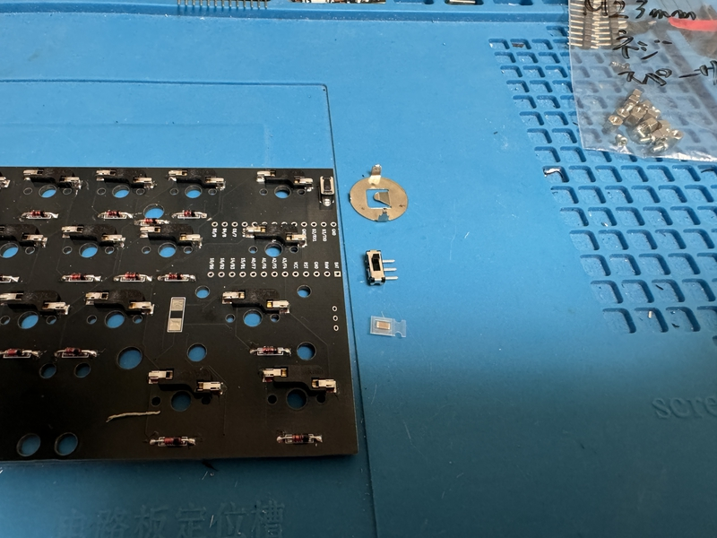

Solder the slide switch first.
 
最初にスライドスッチをはんだ付けします。
 
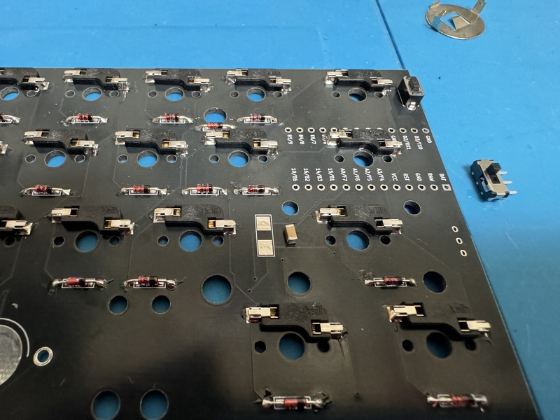

Insert the switch from the back of the PCB with the switch knob facing outward.
 
スイッチのつまみが外側に向くようにして、PCBの裏面から差し込みます。
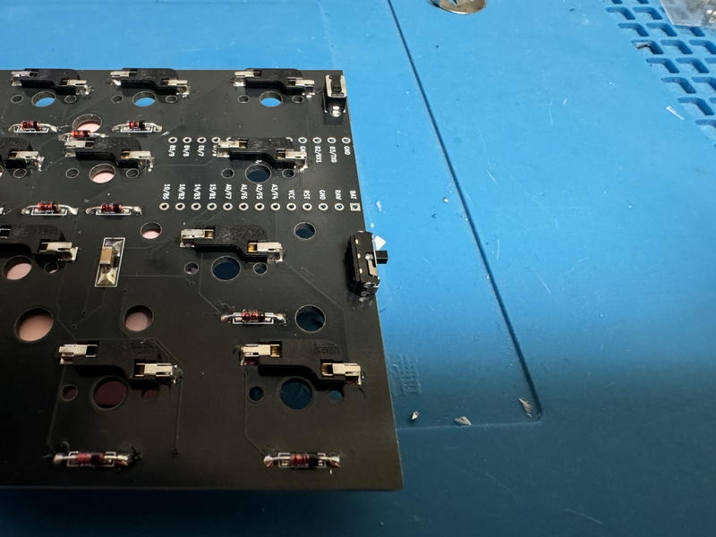

After temporarily fixing it with masking tape, etc., solder the exposed part of the PCB.
 
マスキングテープなどで仮固定をしてから、PCBの表面に出た部分をはんだ付けします。
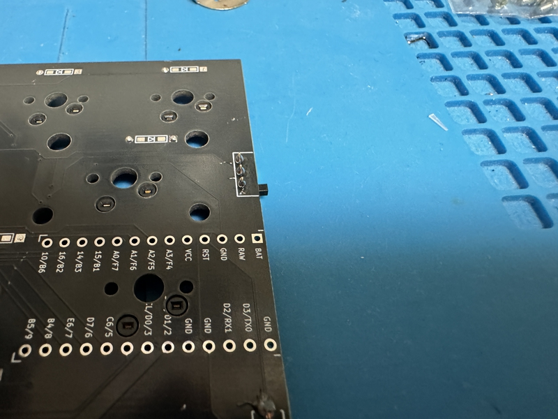
 
Next, solder the capacitor.
 
次に、コンデンサをはんだ付けします。
 
 
First, apply solder to only one side of the two pads.
 
最初に、２つあるパッドの片側だけに、はんだを盛り付けます。
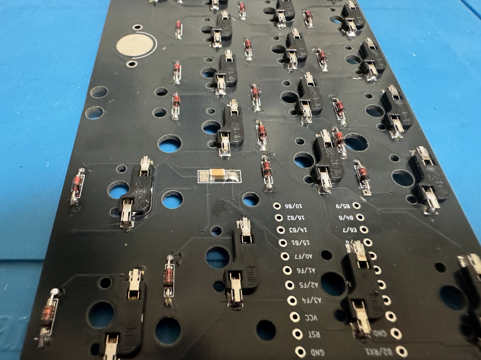

Place the capacitor and fix it by melting the solder.
 
コンデンサを置き、もったはんだを溶かしながら、固定します。
 
Solder the capacitor, applying solder to the remaining pads.
 
残りのパッドにはんだを盛りながら、コンデンサをはんだ付けします。
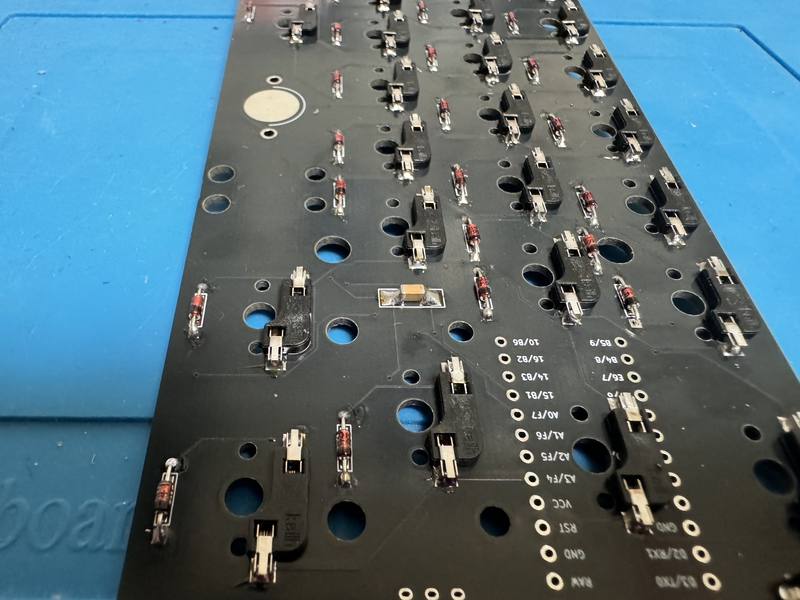
Finally, attach the battery holder.
 
最後に、電池ホルダを取り付けます。
 
Insert it from the back side of the PCB and solder the front side. Using masking tape for temporary fixation will make the work easier.
 
PCBの裏面から差し込んで、表面をはんだ付けします。仮固定にマスキングテープを使うと作業が簡単になります。
 
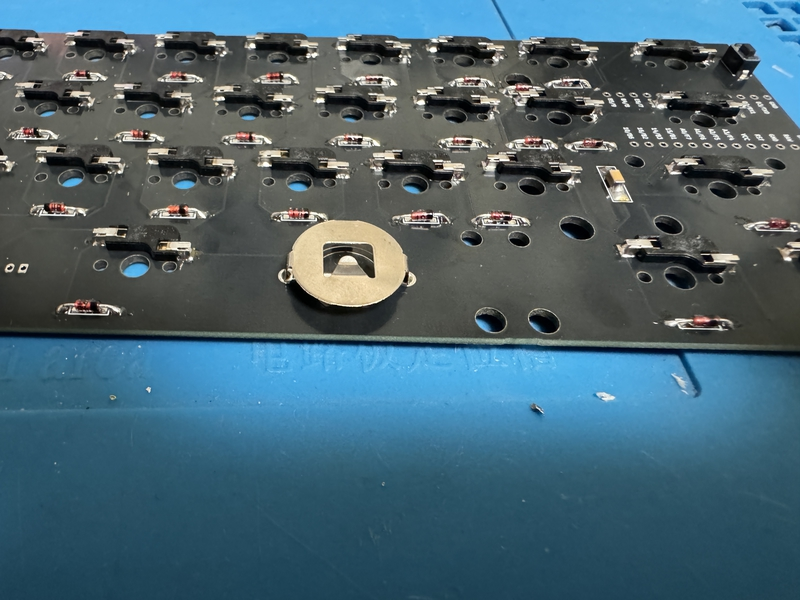

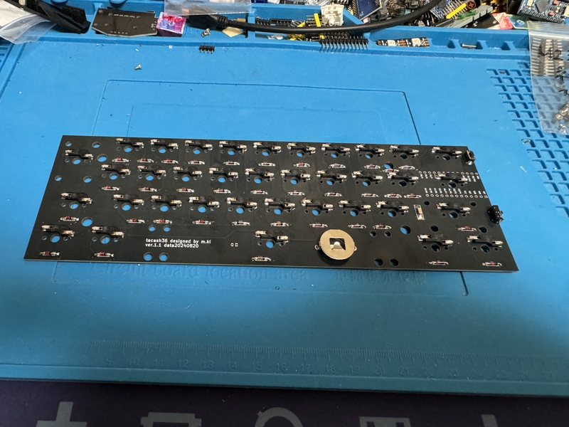

### 4 Install firmware

Install QMK_Firmware from your PC to RP-2040Zero.
 
QMK_FirmwareをPCからRP-2040Zeroにインストールしてください。
 
 
① Download https://github.com/telzo2000/cool336/blob/main/firmware/cool336_vial.uf2 to your PC.
 
① https://github.com/telzo2000/cool336/blob/main/firmware/cool336_vial.uf2　
をPCにダウンロードしておく。

  
② Connect the PC and RP-2040Zero with a USB cable.
 
②PCとRP-2040ZeroをUSBケーブルで繋ぐ。
  
③Press the reset button while pressing the boost button on the RP-2040Zero.
 
③RP-2040Zeroのboostボタン押しながら、resetボタンを押す。
  
④Since there is a folder of RP-2040Zero on the PC screen, drag and drop the downloaded cool336_vial.uf2 there.
 
④PC画面にはRP-2040Zeroのフォルダがあるので、そこに、ダウンロードしたcool336_vial.uf2をドラッグアンドドロップする。
  

⑤Check if it is recognized by connecting to [vial](https://get.vial.today/). Edit the keymap accordingly.
 
⑤[vial](https://get.vial.today/)に繋いで認識するかどうか確認する。合わせてキーマップの編集をする。

### 5 Fix the stabilizer

Attach the stabilizer to the surface of the PCB.
 
PCBの表面にスタビライザーを装着してください。
 

The stabilizer will operate smoothly if it is greased.
 
スタビライザーはグリスをしておくと、滑らかに稼働します。
 
 

### 6a Fix the switch plate(3D Print) with screws

Place the 3D printed switch plate on the surface of the PCB.
 
3Dプリンタで印刷されたスイッチプレートをPCBの表面に載せます。
 

Insert four M2 screws (8mm) from the surface and secure with M2 spacers (3mm) on the back side of the PCB.
 
表面からM2ネジ（8mm）を４本挿して、PCB裏側でM2スペーサー（3mm）で固定してください。
 

### 6b Fix the switch plate(Acrylic) with screws

Insert the acrylic switch plate, the M2 spacer (3mm), and the M2 screw (8mm) in that order to secure it.
 
アクリルのスイッチプレート、M2スペーサー（3mm）の順でM2ネジ（8mm）の順で差し込んで固定します。
 < 
Place the switch plate on the surface of the PCB.
 
スイッチプレートをPCBの表面に載せます。
  
Fix it with M2 spacer (3mm) on the back side of the PCB.
 
PCB裏側でM2スペーサー（3mm）で固定してください。
  

### 7 Insert the key switch

Insert the key switch from the switch plate side.
 
スイッチプレート側からキースイッチを差し込んでいきます。
 
 

Due to the characteristics of the switch plate printed with a 3D printer, the square hole of the key switch may be tight. In that case, use a cutter or other bladed tool to scrape off the burr inside the square hole.
 
スイッチプレートは3Dプリンタで印刷した特性により、もしかしたら、キースイッチの四角穴がきついことがあります。その時は、カッターなど刃物で四角穴内側のバリを削り取ってください。
 

### 8a Fix the bottom plate with screws

With the PCB facing backwards, secure the bottom plate with four M2 screws (4mm). There is a recess with a diameter of 5 mm and a depth of about 1 mm on the top surface of the bottom plate. Make sure that the M2 spacer fits there.
 
PCBを裏側にして、ボトムプレートをM2ネジ（4mm）４本で固定してください。ボトムプレートの上面には1mmほどの深さの直径5mmの凹部があります。そこに、M2スペーサーがはまるようにしてください。
 

### 8b Fix the bottom case with screws

PCBを裏側にして、ボトムケースをM2ネジ（4mm）４本で固定してください。ボトムプレートの上面には1mmほどの深さの直径5mmの凹部があります。そこに、M2スペーサーがはまるようにしてください。
 

 
To prevent the RP2040-Zero from falling inside the case when the cable is connected or disconnected, we recommend placing the enclosed sponge under the USB insertion slot.
 
ケーブルの抜き差しにより、RP2040-Zeroがケース内部で落下することを防ぐため、同封したスポンジをUSB挿入口の下につけることを推奨します。
 
 

### 9 Complete

Attach your favorite keycaps and you're done.
 
お気に入りのキーキャップをつけて完成です。
 

 
Welcome to the world of the best keyboards.
 
最高のキーボードの世界にようこそ。
 